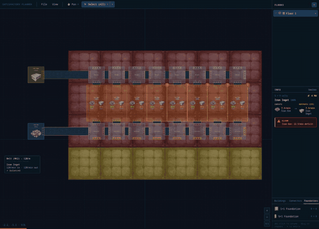

# Satisfactory Planner

> **🤖 Proudly AI Slop** — This entire codebase has been written and is actively managed by [Claude Code](https://claude.ai/claude-code). No human has written a single line of production code.

A visual layout and management tool to help plan and organize factory builds in [Satisfactory](https://www.satisfactorygame.com/). Place buildings, route belts and pipes, organize by layer, and keep your factory designs tidy before committing them in-game.



## Goals

- **Layout assistance** — drag and drop factory buildings onto a grid canvas, snap them to position, and visualize your factory floor plan before building it in-game.
- **Recipe awareness** — the full Satisfactory 1.0 recipe database (150 recipes) is built in, so the planner understands what each building produces and consumes.
- **Build management** — organize complex megafactories into named layers, toggle visibility, and plan expansions without losing track of existing infrastructure.

## Tech Stack

- [React](https://react.dev/) + [Vite](https://vitejs.dev/)
- [react-konva](https://konvajs.org/docs/react/) for canvas rendering

## Getting Started

```bash
npm install
npm run dev
```

## Features

- 250×250 grid canvas with pan, zoom (5%–1000%), and rotate controls
- Place and move buildings snapped to the grid
- Per-building connector definitions (belt and pipe inputs/outputs)
- Layer system — add, rename, reorder, and toggle visibility of layers
- Buildings palette with all major production buildings
- Full recipe database: smelter, constructor, assembler, manufacturer, refinery, blender, and more

## Known Limitations

- **Priority splitters/mergers** — belt demand simulation doesn't model priority logic, so overflow/priority routing won't reflect actual in-game behavior.
- **Pipes and fluid mechanics** — pipe connections, fluid throughput, and headlift are out of scope until we reach that point in our playthrough. Buildings with pipe connectors (refinery, blender, etc.) can be placed but fluid flow is not simulated.

## Controls

| Action | Control |
|---|---|
| Pan | Left drag (pan tool) or middle mouse drag |
| Zoom | Scroll wheel |
| Select building | Click (pointer tool) |
| Move building | Drag (pointer tool) |
| Rotate while placing | `R` or scroll wheel while dragging |
| Pan tool | `H` |
| Pointer tool | `V` |
| Deselect | `Escape` |
